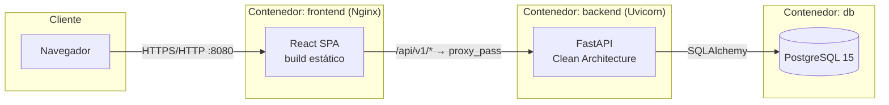

# 🏥 SaludYa — Portal Web de Gestión Hospitalaria

[](LICENSE)
[](backend)
[](frontend)
[](docker-compose.yml)

SaludYa es un portal web que permite a los pacientes de un hospital
**agendar, consultar y cancelar citas médicas en línea**, y a los
administradores gestionar médicos, especialidades y el flujo de citas
desde un panel propio — sin necesidad de que el paciente se desplace
físicamente al hospital para trámites administrativos simples.

Proyecto académico desarrollado con estándares de calidad profesional:
Clean Architecture en el backend, componentes reutilizables en el
frontend, pruebas automatizadas reales (no solo escritas) y
contenerización completa con Docker Compose.

> 📄 Todo el proceso de análisis, diseño y desarrollo por fases está
> documentado en [`docs/fases/`](docs/fases/), y la documentación final
> del sistema en [`docs/`](docs).

---

## Tabla de contenidos

- [Características](#características)
- [Stack tecnológico](#stack-tecnológico)
- [Arquitectura](#arquitectura)
- [Inicio rápido con Docker](#inicio-rápido-con-docker)
- [Credenciales de demostración](#credenciales-de-demostración)
- [Desarrollo sin Docker](#desarrollo-sin-docker)
- [Pruebas](#pruebas)
- [¿Cómo verifico que todo funciona?](docs/GUIA_DE_PRUEBAS.md)
- [Estructura del repositorio](#estructura-del-repositorio)
- [Documentación](#documentación)
- [Licencia](#licencia)

---

## Características

**Módulo público** — landing institucional, historia/misión/visión,
listado de especialidades y médicos, contacto y preguntas frecuentes.

**Módulo paciente** — registro, inicio de sesión, edición de perfil,
agendar cita (con validación de horario, día y disponibilidad del
médico), consultar citas (pendientes e historial) y cancelarlas.

**Módulo administrador** — dashboard con métricas en tiempo real, CRUD
de médicos y especialidades, gestión y cancelación de cualquier cita,
administración de pacientes (desactivación de cuentas).

**Reglas de negocio aplicadas en dos capas** (aplicación + base de
datos, defensa en profundidad):

- No se agendan citas en domingo.
- Horario de atención: 7:00 a. m. a 5:00 p. m.
- Un médico no puede tener dos citas activas a la misma fecha/hora.
- Cancelar una cita libera inmediatamente ese horario para otro paciente.
- Un médico solo puede ser agendado en una especialidad que practique.

---

## Stack tecnológico

| Capa          | Tecnología                                                                                           |
| ------------- | ----------------------------------------------------------------------------------------------------- |
| Frontend      | React 18, Vite, TailwindCSS, Axios, React Router, Vitest, React Testing Library                       |
| Backend       | Python 3.11, FastAPI, SQLAlchemy 2, Pydantic v2, python-jose (JWT), passlib (bcrypt), Alembic, Pytest |
| Base de datos | PostgreSQL 15                                                                                         |
| DevOps        | Docker, Docker Compose, Nginx (reverse proxy + SPA), GitHub                                           |

---

## Arquitectura



El backend sigue **Clean Architecture**: `api/routers` → `services`
(casos de uso) → `repositories` (interfaces + implementación
SQLAlchemy) → `models`. Los routers nunca acceden a SQLAlchemy
directamente y los servicios nunca lanzan `HTTPException`; lanzan
excepciones de dominio (`app/domain/exceptions.py`) que `app/main.py`
traduce a códigos HTTP. Detalle completo en
[`docs/ARQUITECTURA.md`](docs/ARQUITECTURA.md).

---

## Inicio rápido con Docker

Requisitos: [Docker](https://www.docker.com/) y Docker Compose (incluido
en Docker Desktop).

```bash
git clone https://github.com/<tu-usuario>/saludya-hospital-portal.git
cd saludya-hospital-portal

cp .env.example .env
# (opcional) editar .env, especialmente JWT_SECRET_KEY antes de un despliegue real

docker compose up --build
```

Servicios disponibles:

| Servicio                             | URL                        |
| ------------------------------------ | -------------------------- |
| Frontend                             | http://localhost:8080      |
| Backend (API)                        | http://localhost:8000      |
| Documentación interactiva (Swagger) | http://localhost:8000/docs |
| PostgreSQL                           | localhost:5432             |

La primera vez que se crea el volumen de PostgreSQL, se ejecutan
automáticamente `database/schema.sql` (estructura) y
`database/seed.sql` (datos de demostración: especialidades, médicos y
las cuentas de la sección siguiente).

> ✅ ¿Cómo saber si todo quedó funcionando bien? Ver
> [`docs/GUIA_DE_PRUEBAS.md`](docs/GUIA_DE_PRUEBAS.md): cómo revisar
> que los contenedores están corriendo, ver sus logs, probar la API,
> revisar los datos en la base de datos y correr las pruebas
> automatizadas.

Para detener y eliminar los contenedores (conservando los datos):

```bash
docker compose down
```

Para eliminar también el volumen de datos (reinicia la base desde cero):

```bash
docker compose down -v
```

---

## Credenciales de demostración

Sembradas por `database/seed.sql`:

| Rol           | Correo                   | Contraseña      |
| ------------- | ------------------------ | ---------------- |
| Administrador | `admin@saludya.com`    | `Admin1234`    |
| Paciente      | `paciente@saludya.com` | `Paciente1234` |

---

## Desarrollo sin Docker

Ver la guía completa, con solución de problemas comunes, en
[`docs/MANUAL_DESARROLLADOR.md`](docs/MANUAL_DESARROLLADOR.md).

<details>
<summary><strong>Backend</strong></summary>

```bash
cd backend
python -m venv .venv
.venv\Scripts\activate        # Linux/Mac: source .venv/bin/activate
pip install -r requirements.txt
cp .env.example .env          # ajustar DATABASE_URL a un PostgreSQL local

# Con un PostgreSQL local corriendo y las credenciales de .env creadas:
psql -U saludya -d saludya -f ../database/schema.sql
psql -U saludya -d saludya -f ../database/seed.sql

uvicorn app.main:app --reload
```

</details>

<details>
<summary><strong>Frontend</strong></summary>

```bash
cd frontend
npm install
cp .env.example .env          # ajustar VITE_API_URL si el backend no está en localhost:8000
npm run dev                   # http://localhost:5173
```

</details>

---

## Pruebas

Ambas suites se ejecutaron realmente contra el código de este
repositorio (no solo se escribieron) — ver los números exactos y el
detalle de cobertura en [`docs/fases/05-testing.md`](docs/fases/05-testing.md).

```bash
# Backend: 68 pruebas (67 passed + 1 xfail documentado), 96% de cobertura
cd backend
pip install -r requirements-dev.txt
pytest

# Frontend: 41 pruebas (formularios, componentes, rutas, API mock, validaciones)
cd frontend
npm install
npm test
npm run lint     # 0 errores
```

> El único caso `xfail` (`test_cancelar_cita_libera_el_horario_para_nueva_reserva`)
> es esperado: SQLite —usado solo para aislar los tests— no soporta
> índices únicos *parciales* como el de `database/schema.sql`. La regla
> sí se cumple contra PostgreSQL real (Docker Compose).

---

## Estructura del repositorio

```
saludya-hospital-portal/
├── backend/          # API FastAPI (Clean Architecture) — ver backend/app
├── frontend/          # SPA React + Vite — ver frontend/src
├── database/          # schema.sql (modelo físico) + seed.sql (datos demo)
├── docs/               # Documentación final del sistema
│   └── fases/           # Historial de las 8 fases de desarrollo
├── docker-compose.yml
├── .env.example
├── LICENSE
├── CONTRIBUTING.md
└── CHANGELOG.md
```

## Documentación

| Documento                                                       | Contenido                                                  |
| --------------------------------------------------------------- | ---------------------------------------------------------- |
| [`docs/ARQUITECTURA.md`](docs/ARQUITECTURA.md)                 | Clean Architecture, modelo de datos, decisiones de diseño |
| [`docs/API.md`](docs/API.md)                                   | Referencia completa de los 26 endpoints                    |
| [`docs/MANUAL_USUARIO.md`](docs/MANUAL_USUARIO.md)             | Guía de uso para pacientes y administradores              |
| [`docs/MANUAL_DESARROLLADOR.md`](docs/MANUAL_DESARROLLADOR.md) | Puesta en marcha, convenciones y solución de problemas    |
| [`docs/GUIA_DE_PRUEBAS.md`](docs/GUIA_DE_PRUEBAS.md)           | Cómo verificar que todo funciona: contenedores, logs, base de datos, pruebas automatizadas |
| [`docs/evidencias/01-testing-frontend-vitest.md`](docs/evidencias/01-testing-frontend-vitest.md) | Documento formal: qué es Vitest, cómo se usa, evidencia real de ejecución (41/41 pruebas) |
| [`docs/evidencias/02-testing-backend-pytest.md`](docs/evidencias/02-testing-backend-pytest.md) | Documento formal: qué es Pytest, cómo se usa, evidencia real de ejecución (67/68 + cobertura 96%) |
| [`docs/evidencias/03-docker-compose.md`](docs/evidencias/03-docker-compose.md) | Documento formal: qué son Docker/Docker Compose, cómo se usan, evidencia de ejecución del sistema completo |
| [`docs/INFORME.md`](docs/INFORME.md)                           | Informe universitario completo (Fase 8)                    |
| [`docs/fases/`](docs/fases/)                                   | Registro de las 8 fases de desarrollo, en orden            |

## Licencia

Distribuido bajo licencia [MIT](LICENSE). Proyecto académico con fines
demostrativos.
