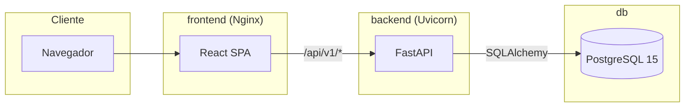
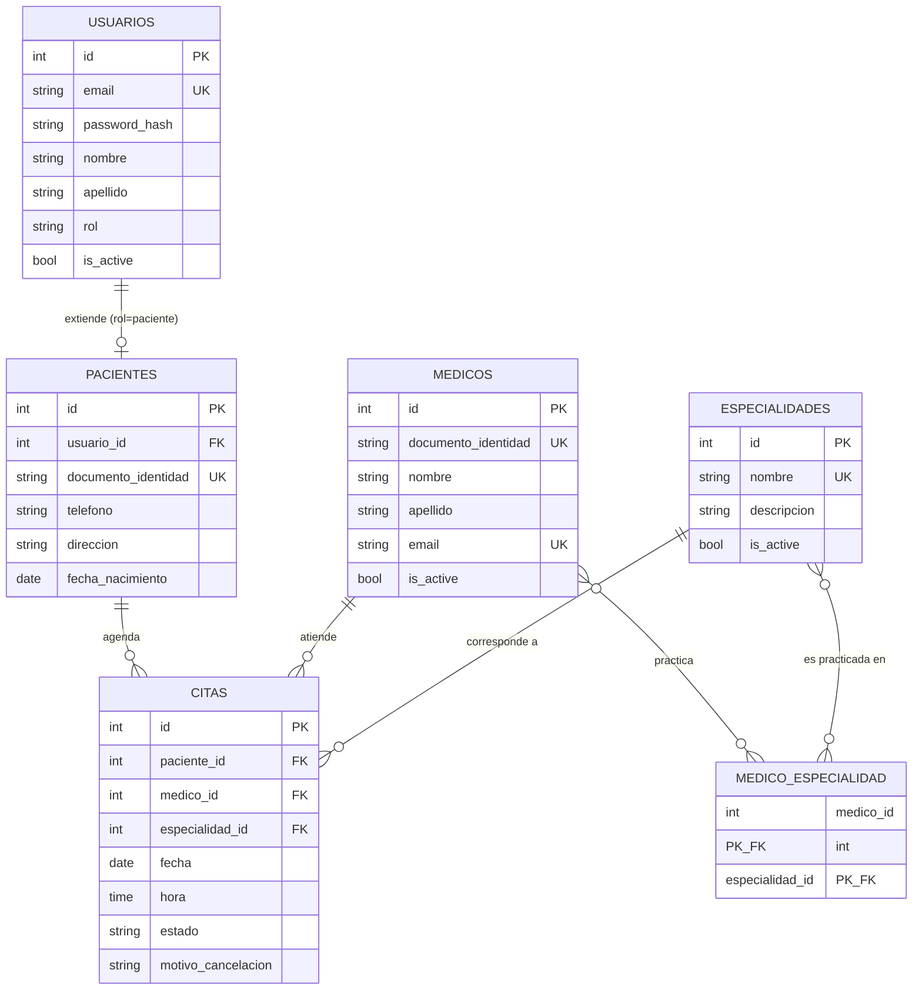

# Arquitectura — SaludYa

Este documento describe la arquitectura final del sistema. Para el
razonamiento paso a paso que llevó a estas decisiones, ver
[`docs/fases/`](fases/) (especialmente las Fases 1-3).

[INSERTAR IMAGEN: Arquitectura]

## 1. Vista general

SaludYa es una aplicación de tres capas físicas, desplegadas como tres
contenedores independientes:



## 2. Backend — Clean Architecture

```
backend/app/
├── main.py            # Wiring: FastAPI app, CORS, exception handlers, routers
├── core/
│   ├── config.py        # Settings tipadas (pydantic-settings)
│   ├── database.py      # Engine, Session, Base, get_db
│   └── security.py      # Hash de contraseñas (bcrypt) y JWT (python-jose)
├── domain/
│   └── exceptions.py    # Excepciones de negocio, independientes de HTTP
├── models.py             # Modelos ORM (SQLAlchemy) — infraestructura
├── schemas.py            # DTOs Pydantic (entrada/salida de la API)
├── repositories.py       # Interfaces (ABC) + implementación SQLAlchemy
├── services.py           # Casos de uso / reglas de negocio
└── api/
    ├── deps.py            # Auth (JWT), autorización por rol, inyección de servicios
    └── routers/            # Un router por recurso
```

### Regla de dependencia

```
api/routers  →  services  →  repositories (interfaces)  →  models
                    ↓
              domain/exceptions
```

- Los **routers** nunca acceden a SQLAlchemy directamente; siempre pasan
  por un servicio inyectado vía `Depends`.
- Los **servicios** (`services.py`) contienen toda la lógica de negocio
  y dependen de las *interfaces abstractas* de `repositories.py`, no de
  SQLAlchemy — así el dominio no conoce el motor de persistencia.
- Los **servicios nunca lanzan `HTTPException`**; lanzan excepciones de
  `domain/exceptions.py` (`NotFoundError`, `ConflictError`,
  `BusinessRuleError`, `UnauthorizedError`, `ForbiddenError`), que
  `main.py` traduce a códigos HTTP mediante `add_exception_handler`.
  Esto mantiene el dominio desacoplado de FastAPI: la lógica de negocio
  se podría probar o reutilizar sin un framework web.

**Decisión de organización:** cada capa vive en un único módulo
(`models.py`, `repositories.py`, `services.py`) en vez de un archivo
por entidad. La separación arquitectónica real está entre capas, no
entre archivos dentro de una misma capa — balance razonable para el
tamaño de este proyecto.

### Autenticación y autorización

- **JWT** (`python-jose`): el login emite un token con claims `sub` (id
  de usuario) y `rol`, expira en `JWT_ACCESS_TOKEN_EXPIRE_MINUTES`
  (60 min por defecto).
- **Contraseñas**: hasheadas con bcrypt (`passlib`), nunca se
  almacenan ni se exponen en texto plano.
- **Autorización por rol**: `require_paciente` / `require_admin`
  (`api/deps.py`) son dependencias de FastAPI que verifican el rol del
  usuario autenticado. Devuelven 403 si el rol no corresponde, 401 si
  no hay token o es inválido.

## 3. Frontend — organización por responsabilidad

```
frontend/src/
├── main.jsx              # Bootstrap: BrowserRouter + AuthProvider + App
├── App.jsx                # Definición de rutas
├── api/
│   ├── client.js           # Instancia Axios + interceptores JWT
│   └── endpoints.js        # Funciones por recurso (authApi, citasApi, ...)
├── context/AuthContext.jsx # Estado de sesión (usuario, login, logout, registro)
├── routes/ProtectedRoute.jsx # Guard de rutas por autenticación/rol
├── components/
│   ├── ui.jsx                # Kit de componentes reutilizables
│   └── layout/                # Navbar, Footer, PublicLayout, DashboardLayout
├── constants/institucional.js # Contenido estático (historia, misión, FAQ)
├── utils/validadores.js       # Validaciones de formularios (testeables por separado)
└── pages/
    ├── public/, auth/, paciente/, admin/
```

Las páginas nunca llaman a Axios directamente: siempre a través de
`api/endpoints.js`, mismo principio de capas que en el backend.
`AuthContext` es la única fuente de verdad del usuario autenticado; al
cargar la app, si hay un token guardado, se valida contra `GET
/auth/me` — si es inválido, se limpia la sesión sin romper la
navegación pública.

`ProtectedRoute` redirige a `/login` si no hay sesión, y a `/` si el
rol no coincide con el requerido por el grupo de rutas — reflejo en el
cliente de los mismos límites que ya aplica el backend, como defensa en
profundidad de *experiencia* (la seguridad real vive en el backend, que
vuelve a validar todo).

## 4. Modelo de datos

[INSERTAR IMAGEN: DER]



### Por qué existe cada tabla

| Tabla | Justificación |
|---|---|
| `usuarios` | Centraliza la autenticación (email, password hash, rol) para cualquier tipo de cuenta, evitando duplicar lógica de login. |
| `pacientes` | Extensión 1:1 de `usuarios` con los atributos exclusivos del rol paciente; evita columnas nulas en `usuarios` para administradores. |
| `medicos` | Recurso gestionado por el administrador (CRUD); no inicia sesión, por lo que no hereda de `usuarios`. |
| `especialidades` | Catálogo maestro reutilizado por el listado público, el CRUD admin y las citas. |
| `medico_especialidad` | Resuelve la relación N:M médico↔especialidad sin duplicar datos (1FN/2FN). |
| `citas` | Tabla transaccional central: conecta paciente, médico y especialidad en un momento concreto, con su propio ciclo de vida (`estado`). |

### Normalización

- **1FN**: cada atributo es atómico; las especialidades de un médico no
  se guardan como lista en una columna, sino en `medico_especialidad`.
- **2FN**: la única tabla con clave compuesta (`medico_especialidad`)
  no tiene atributos no clave dependientes de solo una parte de la
  clave (no guarda, por ejemplo, el nombre de la especialidad).
- **3FN**: no hay dependencias transitivas — el nombre del médico no se
  guarda en `citas` (se accede vía `JOIN` a `medicos`), ni el nombre de
  la especialidad se repite en `medicos` o `citas`.

### Regla de no-doble-reserva: índice único parcial

`citas` no usa un `UNIQUE (medico_id, fecha, hora)` de tabla completa,
sino un **índice único parcial**:

```sql
CREATE UNIQUE INDEX uq_citas_medico_fecha_hora_activa
    ON citas (medico_id, fecha, hora)
    WHERE estado <> 'cancelada';
```

Un `UNIQUE` incondicional impediría agendar una nueva cita en un
horario cuya cita anterior fue cancelada, contradiciendo la regla de
negocio "cancelar una cita libera el horario del médico". El modelo
SQLAlchemy (`backend/app/models.py`, `Cita.__table_args__`) refleja
exactamente el mismo índice mediante `postgresql_where`.

> Esta corrección se aplicó sobre el `schema.sql` original durante la
> reorganización final del proyecto: el script tenía un `UNIQUE` de
> tabla completo que contradecía tanto el modelo SQLAlchemy como la
> regla de negocio documentada. Ver `CHANGELOG.md`.

### Doble barrera de reglas de negocio

| Regla | Capa aplicación (`services.py`) | Capa base de datos (`schema.sql`) |
|---|---|---|
| No citas en domingo | `CitaService._validar_regla_horario` | `CHECK (EXTRACT(DOW FROM fecha) <> 0)` |
| Horario 7:00–17:00 | `CitaService._validar_regla_horario` | `CHECK (hora BETWEEN '07:00' AND '17:00')` |
| No doble reserva activa | `CitaRepository.existe_conflicto` (excluye canceladas) | Índice único parcial `WHERE estado <> 'cancelada'` |
| Médico debe practicar la especialidad | `CitaService.crear_cita` | — (regla de aplicación) |
| No cancelar cita ajena | `CitaService.cancelar_como_paciente` | — |

La aplicación es la fuente de la regla (mensajes de error claros); la
base de datos es la red de seguridad ante condiciones de carrera o
accesos fuera de la API.

## 5. Decisiones de diseño relevantes

1. **Los médicos no inician sesión.** Son un recurso administrado por
   el administrador (CRUD), no un actor autenticado — el alcance de
   Fase 1 solo contempla login para pacientes y administradores.
2. **Borrado lógico** (`is_active`) en `usuarios`, `medicos` y
   `especialidades`, no borrado físico — preserva el historial de citas
   ya realizadas.
3. **Contenido institucional estático** (`constants/institucional.js`
   en el frontend), no editable desde el panel admin, porque ninguna
   historia de usuario lo pide. Documentado como extensión futura
   posible (tabla `contenido_institucional` + endpoints CRUD).
4. **Duración de cita**: no especificada en los requisitos; se asume
   una franja de 30 minutos a nivel de aplicación (frontend, selector
   de horas), no de base de datos.

## 6. Trazabilidad de historias de usuario

Ver la tabla completa de HU → endpoint → página en
[`docs/API.md`](API.md) y en `docs/fases/03-backend.md` /
`docs/fases/04-frontend.md`.
