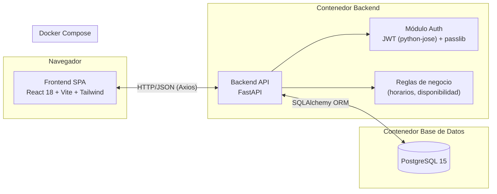
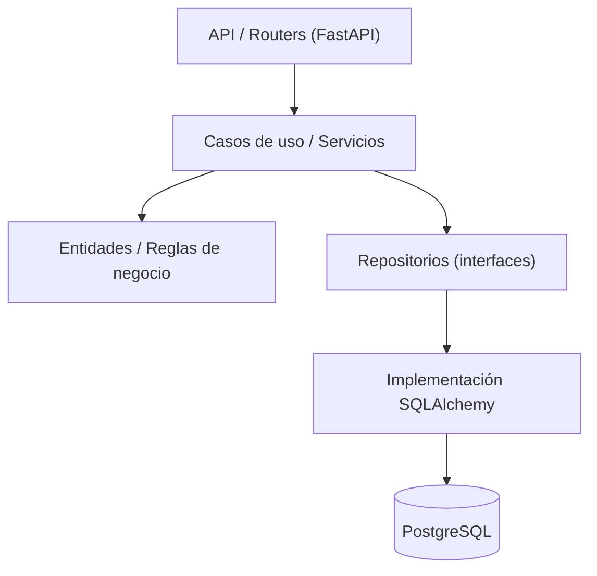

# SaludYa – Portal Web de Gestión Hospitalaria

## Fase 1 — Análisis y Planificación

Estado: **Aprobada**.

---

## 1. Resumen ejecutivo

SaludYa es un portal web que permite a pacientes registrarse, autenticarse y gestionar citas médicas (agendar, consultar, cancelar) sin acudir físicamente al hospital, y ofrece a los administradores un panel para gestionar médicos, especialidades, pacientes y citas. El objetivo es reducir la congestión presencial del hospital derivada de trámites administrativos simples.

## 2. Problema, objetivo y alcance

**Problema:** los pacientes deben ir físicamente al hospital para trámites administrativos simples (agendar, consultar o cancelar citas; conocer horarios y especialidades), generando filas, pérdida de tiempo y sobrecarga del personal.

**Objetivo general:** diseñar y desarrollar un Portal Web Hospitalario moderno que permita gestionar consultas administrativas de manera virtual.

**Alcance de este proyecto (in scope):**
- Portal público informativo (landing, especialidades, médicos, contacto, FAQ).
- Módulo paciente: registro, login (JWT), perfil, agendar/consultar/cancelar citas.
- Módulo administrador: dashboard, CRUD de médicos y especialidades, gestión de citas y pacientes.
- Backend REST con FastAPI, base de datos PostgreSQL normalizada.
- Contenerización con Docker y documentación completa.

**Fuera de alcance (out of scope):**
- Pagos en línea o facturación.
- Historia clínica electrónica / expediente médico.
- Notificaciones push o SMS (se documenta como mejora futura).
- Telemedicina (videoconsulta).

## 3. Objetivos específicos

1. Permitir registro e inicio de sesión de pacientes con autenticación JWT.
2. Permitir agendar, consultar y cancelar citas médicas respetando reglas de negocio (horario, día, disponibilidad del médico).
3. Exponer información institucional (historia, misión, visión, especialidades, médicos, contacto, FAQ).
4. Proveer un panel administrativo con dashboard y CRUD de médicos, especialidades, pacientes y citas.
5. Garantizar una base de datos normalizada (hasta 3FN) con integridad referencial.
6. Cubrir backend y frontend con pruebas automatizadas (cobertura backend >80%).
7. Empaquetar el sistema completo con Docker Compose para despliegue reproducible en un solo comando.
8. Documentar el proyecto a nivel profesional (README, manuales, API, arquitectura) y a nivel académico (informe universitario).

## 4. Metodología de trabajo

Se adopta **Scrum adaptado** a un desarrollo por fases secuenciales (dado que el "equipo" es un solo desarrollador apoyado por Claude actuando como equipo multidisciplinario):

- Cada **Fase** del proyecto (ver sección 6) se trata como un **Sprint**.
- Cada fase produce un incremento funcional y documentado.
- No se inicia una fase nueva sin el cierre/aprobación de la anterior.
- Al final de cada fase se entrega: código o documento correspondiente + justificación de decisiones + checklist de completitud.

Roles aplicados durante el desarrollo:

| Rol | Responsabilidad principal en este proyecto |
|---|---|
| Arquitecto de Software Senior | Define Clean Architecture, límites entre capas, decisiones estructurales |
| Tech Lead | Coordina fases, revisa consistencia técnica entre frontend/backend |
| Dev Frontend Senior | Implementa React + Vite + Tailwind |
| Dev Backend Senior | Implementa FastAPI + SQLAlchemy + JWT |
| Ingeniero DevOps | Docker, Docker Compose, variables de entorno |
| Ingeniero QA | Pytest, Vitest, cobertura, casos de prueba |
| Diseñador UX/UI | Paleta de color, componentes, accesibilidad |
| DBA | Modelo de datos, normalización, DER |
| Documentador Técnico | README, manuales, API.md, ARQUITECTURA.md |
| Líder de Proyecto Scrum | Backlog, historias de usuario, cronograma, seguimiento de fases |

## 5. Stack tecnológico (resumen)

| Capa | Tecnología | Motivo breve |
|---|---|---|
| Frontend | React 18 + Vite | SPA moderna, HMR rápido, ecosistema maduro |
| Estilos | TailwindCSS | Diseño consistente, utility-first, rapidez |
| HTTP client | Axios | Interceptores para JWT, manejo de errores centralizado |
| Ruteo | React Router | Navegación SPA estándar de facto |
| Testing FE | Vitest + React Testing Library | Integración nativa con Vite, pruebas centradas en comportamiento |
| Backend | FastAPI | Alto rendimiento, tipado con Pydantic, documentación OpenAPI automática |
| ORM | SQLAlchemy | Mapeo objeto-relacional maduro, control fino de queries |
| Validación | Pydantic | Validación de esquemas y serialización tipada |
| Auth | python-jose + passlib | Estándar para JWT y hashing seguro de contraseñas (bcrypt) |
| Testing BE | Pytest | Estándar de facto en Python, fixtures potentes |
| Base de datos | PostgreSQL 15 | Robustez transaccional, integridad referencial, uso extendido en producción |
| Contenerización | Docker + Docker Compose | Entorno reproducible, un solo comando de arranque |
| Control de versiones | Git + GitHub | Estándar de la industria, trazabilidad de cambios |

La justificación extendida (qué es, para qué sirve, ventajas) de cada tecnología se desarrollará en el **Informe Universitario (Fase 8)**, como exige el alcance académico del proyecto.

## 6. Cronograma (por fases)

Cronograma académico estimado, 2 semanas por fase (16 semanas / 4 meses en total). Cada fase requiere aprobación explícita antes de avanzar a la siguiente.

| Fase | Contenido | Duración estimada | Entregable |
|---|---|---|---|
| 1 | Análisis y planificación | Semana 1-2 | Este documento |
| 2 | Diseño de base de datos | Semana 3-4 | DER, modelo lógico y físico, script SQL |
| 3 | Backend completo | Semana 5-7 | API FastAPI funcional con JWT y reglas de negocio |
| 4 | Frontend completo | Semana 8-10 | SPA React conectada al backend |
| 5 | Testing | Semana 11-12 | Suite Pytest + Vitest, reporte de cobertura |
| 6 | Docker | Semana 13 | docker-compose funcional (`docker compose up --build`) |
| 7 | Documentación | Semana 14 | README, manuales, API.md, ARQUITECTURA.md |
| 8 | Informe universitario | Semana 15-16 | Informe completo con todas las secciones académicas |

## 7. Backlog del producto (priorizado)

Priorización MoSCoW (Must / Should / Could).

**Epic 1 — Portal público**
- [Must] Landing page institucional (historia, misión, visión).
- [Must] Listado de especialidades.
- [Must] Listado de médicos.
- [Should] Página de contacto.
- [Should] Sección de preguntas frecuentes (FAQ).

**Epic 2 — Cuenta de paciente**
- [Must] Registro de paciente con validación de correo y contraseña.
- [Must] Inicio de sesión con JWT.
- [Must] Cierre de sesión.
- [Should] Edición de perfil del paciente.

**Epic 3 — Gestión de citas (paciente)**
- [Must] Agendar cita (validando horario 7:00–17:00, no domingos, no doble reserva del médico).
- [Must] Consultar citas propias (próximas e historial).
- [Must] Cancelar cita propia.

**Epic 4 — Panel administrativo**
- [Must] Dashboard con métricas generales (citas del día, por especialidad, etc.).
- [Must] CRUD de médicos.
- [Must] CRUD de especialidades.
- [Must] Listado y gestión de citas (todas las citas del sistema).
- [Should] Administración de pacientes (listar, ver detalle, desactivar).

**Epic 5 — Calidad y despliegue**
- [Must] Pruebas automatizadas backend (Pytest) y frontend (Vitest + RTL).
- [Must] Contenerización completa con Docker Compose.
- [Should] Cobertura de pruebas backend > 80%.

## 8. Historias de usuario

Formato: *Como [rol], quiero [acción], para [beneficio]*, con criterios de aceptación.

### Módulo público

**HU-01** — Como visitante, quiero ver la landing page del hospital, para conocer su historia, misión y visión antes de decidir usar sus servicios.
- Criterios: la página carga sin autenticación; muestra historia, misión y visión; es responsive.

**HU-02** — Como visitante, quiero ver el listado de especialidades médicas, para saber si el hospital atiende lo que necesito.
- Criterios: lista todas las especialidades activas; cada una muestra nombre y descripción breve.

**HU-03** — Como visitante, quiero ver el listado de médicos con su especialidad, para elegir con quién agendar.
- Criterios: lista médicos activos con nombre, especialidad y foto/ícono; permite filtrar por especialidad.

**HU-04** — Como visitante, quiero acceder a datos de contacto y FAQ, para resolver dudas sin llamar al hospital.
- Criterios: página de contacto con dirección/teléfono; FAQ con mínimo 5 preguntas frecuentes.

### Módulo paciente

**HU-05** — Como paciente nuevo, quiero registrarme con mis datos, para poder agendar citas en línea.
- Criterios: valida formato de correo, fuerza mínima de contraseña, campos obligatorios completos; rechaza correos duplicados.

**HU-06** — Como paciente registrado, quiero iniciar sesión, para acceder a mi cuenta de forma segura.
- Criterios: emite JWT válido; rechaza credenciales incorrectas con mensaje claro; bloquea acceso a rutas protegidas sin token.

**HU-07** — Como paciente autenticado, quiero ver y editar mi perfil, para mantener mis datos actualizados.
- Criterios: muestra datos actuales; permite editar teléfono/dirección; valida antes de guardar.

**HU-08** — Como paciente autenticado, quiero agendar una cita eligiendo médico, especialidad, fecha y hora, para no tener que ir al hospital a solicitarla.
- Criterios: no permite domingos; solo horario 7:00–17:00; no permite dos citas para el mismo médico a la misma hora; confirma la cita creada.

**HU-09** — Como paciente autenticado, quiero consultar mis citas (próximas y pasadas), para organizarme.
- Criterios: lista separada por estado (pendiente, completada, cancelada); muestra médico, especialidad, fecha y hora.

**HU-10** — Como paciente autenticado, quiero cancelar una cita propia, para liberar el espacio si ya no la necesito.
- Criterios: solo permite cancelar citas propias y futuras; cambia el estado a "cancelada"; libera el horario del médico.

**HU-11** — Como paciente autenticado, quiero cerrar sesión, para proteger mi cuenta en dispositivos compartidos.
- Criterios: invalida el estado de sesión en el cliente y redirige a login.

### Módulo administrador

**HU-12** — Como administrador, quiero ver un dashboard con métricas clave, para monitorear la operación del hospital.
- Criterios: muestra total de citas del día, citas por especialidad, médicos activos, pacientes registrados.

**HU-13** — Como administrador, quiero gestionar médicos (crear, editar, eliminar/desactivar), para mantener actualizada la plantilla médica.
- Criterios: CRUD completo; asocia médico a una o más especialidades; valida campos obligatorios.

**HU-14** — Como administrador, quiero gestionar especialidades (crear, editar, eliminar/desactivar), para reflejar los servicios reales del hospital.
- Criterios: CRUD completo; no permite eliminar especialidad con médicos activos asociados sin confirmación.

**HU-15** — Como administrador, quiero ver y gestionar todas las citas del sistema, para reasignar o cancelar cuando sea necesario.
- Criterios: lista filtrable por médico/especialidad/fecha/estado; permite cancelar cualquier cita con motivo.

**HU-16** — Como administrador, quiero administrar pacientes (ver listado y detalle, desactivar cuentas), para mantener el control de usuarios del sistema.
- Criterios: lista paginada de pacientes; vista de detalle con historial de citas; acción de desactivar cuenta.

## 9. Casos de uso principales

### CU-01 Registrar paciente
- **Actor:** visitante.
- **Precondición:** el correo no debe existir previamente en el sistema.
- **Flujo principal:** 1) el visitante abre el formulario de registro; 2) ingresa nombre, correo, contraseña y datos requeridos; 3) el sistema valida formato de correo y fuerza de contraseña; 4) el sistema crea el paciente con contraseña hasheada (passlib); 5) el sistema confirma el registro.
- **Flujo alterno:** correo ya registrado → el sistema muestra error y no crea el registro.
- **Postcondición:** el paciente puede iniciar sesión con sus credenciales.

### CU-02 Iniciar sesión
- **Actor:** paciente o administrador.
- **Precondición:** cuenta existente y activa.
- **Flujo principal:** 1) el usuario ingresa correo y contraseña; 2) el sistema valida credenciales contra el hash almacenado; 3) el sistema emite un JWT con rol (paciente/admin) y tiempo de expiración; 4) el cliente almacena el token para peticiones subsecuentes.
- **Flujo alterno:** credenciales inválidas → error 401, sin emisión de token.
- **Postcondición:** el usuario queda autenticado y puede acceder a rutas protegidas según su rol.

### CU-03 Agendar cita
- **Actor:** paciente autenticado.
- **Precondición:** JWT válido; médico y especialidad existentes.
- **Flujo principal:** 1) el paciente selecciona especialidad y médico; 2) el sistema muestra horarios disponibles (7:00–17:00, excluyendo domingos y horarios ya ocupados); 3) el paciente elige fecha/hora; 4) el sistema valida reglas de negocio (día, horario, disponibilidad del médico); 5) el sistema crea la cita en estado "pendiente".
- **Flujo alterno:** horario ya ocupado por el mismo médico → el sistema rechaza la solicitud e informa al paciente.
- **Postcondición:** la cita queda registrada y visible tanto para el paciente como para el administrador.

### CU-04 Cancelar cita
- **Actor:** paciente autenticado (cita propia) o administrador (cualquier cita).
- **Precondición:** la cita existe y está en estado "pendiente".
- **Flujo principal:** 1) el usuario selecciona la cita a cancelar; 2) el sistema valida pertenencia (si es paciente) o permisos (si es admin); 3) el sistema cambia el estado a "cancelada" y libera el horario del médico.
- **Flujo alterno:** el paciente intenta cancelar una cita que no le pertenece → el sistema rechaza con error 403.
- **Postcondición:** el horario queda disponible nuevamente para otros pacientes.

### CU-05 Gestionar médicos (CRUD)
- **Actor:** administrador.
- **Precondición:** sesión activa con rol administrador.
- **Flujo principal:** 1) el administrador accede al módulo de médicos; 2) puede crear un médico asociándolo a una o más especialidades; 3) puede editar sus datos; 4) puede desactivarlo (borrado lógico para preservar historial de citas).
- **Postcondición:** el listado público de médicos refleja únicamente médicos activos.

### CU-06 Consultar dashboard administrativo
- **Actor:** administrador.
- **Precondición:** sesión activa con rol administrador.
- **Flujo principal:** 1) el administrador accede al dashboard; 2) el sistema calcula y muestra métricas (citas del día, por especialidad, médicos activos, pacientes registrados).
- **Postcondición:** el administrador tiene visibilidad operativa en tiempo real.

## 10. Diagrama general de arquitectura



**Vista de capas (Clean Architecture, backend):**



La API (routers) depende de los casos de uso; los casos de uso dependen de entidades e interfaces de repositorio, nunca al revés. La implementación concreta con SQLAlchemy queda en la capa externa, de modo que el dominio no depende de detalles de infraestructura.

## 11. Estructura de carpetas propuesta (referencial para fases siguientes)

```
saludya/
├── frontend/          # React + Vite + Tailwind (Fase 4)
├── backend/           # FastAPI + SQLAlchemy (Fase 3)
├── database/          # Scripts SQL, migraciones (Fase 2)
├── docker/            # Dockerfiles auxiliares si aplica (Fase 6)
├── docs/              # Documentación técnica y académica (Fase 7-8)
├── docker-compose.yml
├── .env.example
├── README.md
├── LICENSE
├── .gitignore
├── CONTRIBUTING.md
└── CHANGELOG.md
```

## 12. Riesgos identificados y mitigación

| Riesgo | Impacto | Mitigación |
|---|---|---|
| Doble reserva de horario por condición de carrera | Alto | Restricción única a nivel de base de datos (médico + fecha + hora) además de validación en backend |
| Contraseñas débiles | Medio | Validación de política de contraseña + hashing con bcrypt (passlib) |
| Exposición de datos sensibles de pacientes | Alto | JWT con expiración, HTTPS en producción, control de acceso por rol |
| Falta de cobertura de pruebas | Medio | Meta explícita >80% backend, revisión en Fase 5 antes de avanzar |
| Desalineación frontend/backend (contratos de API) | Medio | Documentación OpenAPI automática de FastAPI + API.md en Fase 7 |

## 13. Propuestas de valor agregado (más allá de lo solicitado explícitamente)

Como Arquitecto de Software Senior, se identifican elementos estándar en la industria que se incorporarán en fases posteriores sin desviarse del alcance:

- **Borrado lógico (`is_active`)** en médicos, especialidades y pacientes en lugar de borrado físico, para preservar el historial de citas.
- **Restricción de unicidad a nivel de BD** (médico + fecha + hora) como segunda barrera contra doble reserva, además de la validación en backend.
- **Manejo centralizado de errores** en FastAPI (exception handlers) y en Axios (interceptor) para respuestas consistentes.
- **Migraciones versionadas** (Alembic) en vez de scripts SQL sueltos, para trazabilidad de cambios de esquema.
- **Variables de entorno tipadas** (Pydantic Settings) en el backend en lugar de lectura manual de `os.environ`.
- **Health check endpoint** (`/health`) para verificar que la API y la conexión a base de datos están operativas (útil en Docker Compose).
- **CI básico con GitHub Actions** (lint + tests) como estándar mínimo de un repositorio profesional, documentado en Fase 6/7.

Estas propuestas se detallarán y justificarán al implementarse en su fase correspondiente.

---

### Checklist de cierre de Fase 1

- [x] Problema, solución y objetivos definidos.
- [x] Metodología y roles definidos.
- [x] Stack tecnológico definido y justificado (resumen).
- [x] Cronograma por fases.
- [x] Backlog priorizado.
- [x] Historias de usuario (16) con criterios de aceptación.
- [x] Casos de uso principales (6) con flujos alterno.
- [x] Diagrama general de arquitectura y de capas.
- [x] Riesgos identificados.

**Aprobada por el cliente el 2026-08-07.** Fase 2 (Diseño de Base de Datos) completada a continuación.
