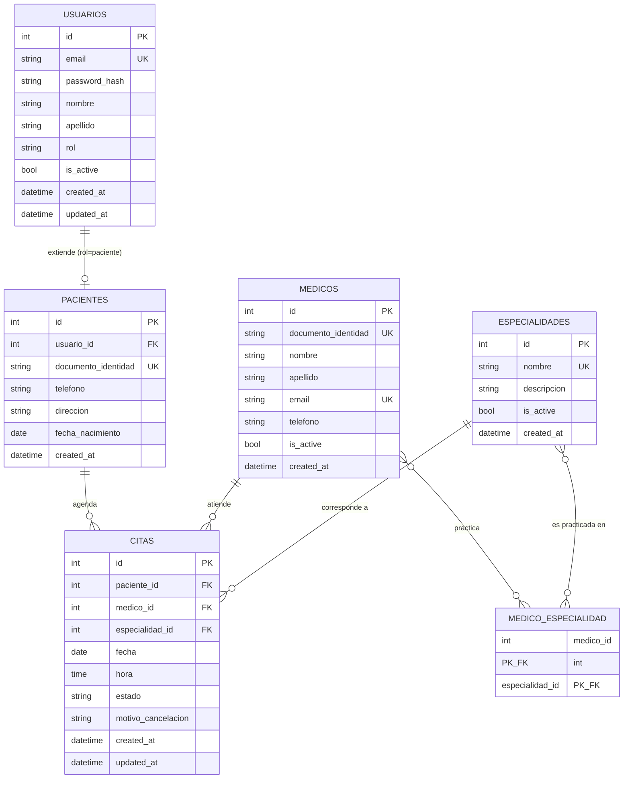

# SaludYa – Portal Web de Gestión Hospitalaria

## Fase 2 — Diseño de Base de Datos

Estado: **Aprobada**.

---

## 1. Decisiones de diseño y supuestos

Antes del modelo, se explicitan las decisiones tomadas (para que sean revisables):

1. **Los médicos no inician sesión en el sistema.** El alcance definido en Fase 1 solo contempla autenticación para pacientes y administradores. Los médicos son un recurso administrado por el administrador (CRUD), no un actor que se autentica. Esto se puede extender en una fase futura si se requiere un portal médico.
2. **`usuarios` es la tabla de autenticación** (email, password, rol). `pacientes` es una extensión 1:1 de `usuarios` para el rol paciente, y contiene únicamente los atributos que no aplican a un administrador (documento de identidad, teléfono, dirección, fecha de nacimiento). Esto evita columnas que quedarían en `NULL` para los administradores.
3. **Relación médico–especialidad es N:M** (un médico puede tener más de una especialidad; una especialidad la practican varios médicos), resuelta con tabla intermedia `medico_especialidad`.
4. **La cita guarda explícitamente `especialidad_id`**, aunque se derive del médico, porque un médico con dos especialidades puede ser agendado para una u otra; la cita debe registrar bajo cuál especialidad fue solicitada.
5. **Borrado lógico** (`is_active`) en `usuarios`, `medicos` y `especialidades` en lugar de borrado físico, para preservar el historial de citas ya realizadas (propuesta de valor agregado de Fase 1, sección 13).
6. **Duración de cita:** no se especifica en los requisitos; se asume una franja de 30 minutos por defecto a nivel de aplicación (no de base de datos), documentado aquí como supuesto explícito para no bloquear el diseño.
7. **No doble reserva mediante índice único parcial**, no un `UNIQUE` de tabla completo (ver sección 7). Esta corrección se aplicó durante la Fase 3 al detectar que un `UNIQUE` incondicional impediría reutilizar un horario después de cancelar una cita, contradiciendo la HU-10 ("cancelar libera el horario").

## 2. Normalización

### Primera Forma Normal (1FN)

Se cumple en todas las tablas: cada atributo es atómico y no existen grupos repetitivos ni listas dentro de una misma columna.

- El caso que rompería 1FN sería almacenar las especialidades de un médico como una lista separada por comas dentro de `medicos`. Se evita mediante la tabla `medico_especialidad`, donde cada fila representa una única relación médico–especialidad.

### Segunda Forma Normal (2FN)

Se cumple: todas las tablas con clave primaria simple satisfacen 2FN de forma trivial (2FN solo aplica a claves compuestas). La única tabla con clave compuesta es `medico_especialidad` (`medico_id`, `especialidad_id`), y no tiene atributos no clave que dependan solo de una parte de la clave — no almacena, por ejemplo, el nombre de la especialidad (eso dependería solo de `especialidad_id`, violando 2FN).

### Tercera Forma Normal (3FN)

Se cumple: no existen dependencias transitivas. Ejemplos concretos de lo que se evitó:

- No se guarda el nombre/apellido del médico dentro de `citas` (dependería de `medico_id`, no de la clave de `citas`). Se accede vía `JOIN`.
- No se guarda el nombre de la especialidad dentro de `medicos` ni de `citas`; se referencia por `especialidad_id`.
- No se guarda el teléfono/dirección del paciente dentro de `citas`; residen en `pacientes`, accesibles vía `paciente_id`.
- `usuarios` no repite `nombre`/`apellido` en `pacientes` (se consultan por `usuario_id`).

## 3. Diagrama Entidad-Relación (DER)

## 4. Por qué existe cada tabla (justificación)

| Tabla | Por qué existe |
|---|---|
| `usuarios` | Centraliza la autenticación (email, password hash, rol) para cualquier tipo de cuenta (paciente o administrador), evitando duplicar lógica de login por rol. |
| `pacientes` | Guarda los atributos exclusivos del rol paciente (documento, teléfono, dirección, fecha de nacimiento) que no tiene sentido tener en un administrador; mantiene `usuarios` limpia y evita columnas nulas. |
| `medicos` | Es el recurso gestionado por el administrador (CRUD médicos); no requiere login, por eso no hereda de `usuarios`. |
| `especialidades` | Catálogo maestro de especialidades, reutilizado tanto por el listado público como por el CRUD administrativo y por las citas. |
| `medico_especialidad` | Resuelve la relación N:M entre médicos y especialidades sin duplicar datos ni romper 1FN/2FN. |
| `citas` | Tabla transaccional central: conecta paciente, médico y especialidad en un momento (fecha/hora) concreto, con su propio ciclo de vida (`estado`). |

## 5. Relaciones

- **usuarios 1—0..1 pacientes**: un usuario con rol `paciente` tiene exactamente un registro en `pacientes`; un usuario `administrador` no tiene registro en `pacientes`.
- **pacientes 1—N citas**: un paciente puede tener muchas citas; cada cita pertenece a un único paciente.
- **medicos 1—N citas**: un médico puede tener muchas citas; cada cita es atendida por un único médico.
- **especialidades 1—N citas**: cada cita corresponde a una única especialidad; una especialidad aparece en muchas citas.
- **medicos N—M especialidades** (vía `medico_especialidad`): un médico puede tener varias especialidades; una especialidad puede ser practicada por varios médicos.

## 6. Modelo lógico (columnas, tipos y restricciones)

### `usuarios`

| Columna | Tipo | Restricciones |
|---|---|---|
| id | SERIAL | PK |
| email | VARCHAR(150) | UNIQUE, NOT NULL |
| password_hash | VARCHAR(255) | NOT NULL |
| nombre | VARCHAR(100) | NOT NULL |
| apellido | VARCHAR(100) | NOT NULL |
| rol | VARCHAR(20) | NOT NULL, CHECK IN ('paciente','administrador') |
| is_active | BOOLEAN | NOT NULL, DEFAULT true |
| created_at | TIMESTAMPTZ | NOT NULL, DEFAULT now() |
| updated_at | TIMESTAMPTZ | NOT NULL, DEFAULT now() |

### `pacientes`

| Columna | Tipo | Restricciones |
|---|---|---|
| id | SERIAL | PK |
| usuario_id | INTEGER | UNIQUE, NOT NULL, FK → usuarios(id) |
| documento_identidad | VARCHAR(30) | UNIQUE, NOT NULL |
| telefono | VARCHAR(20) | NULL |
| direccion | VARCHAR(200) | NULL |
| fecha_nacimiento | DATE | NULL |
| created_at | TIMESTAMPTZ | NOT NULL, DEFAULT now() |

### `medicos`

| Columna | Tipo | Restricciones |
|---|---|---|
| id | SERIAL | PK |
| documento_identidad | VARCHAR(30) | UNIQUE, NOT NULL |
| nombre | VARCHAR(100) | NOT NULL |
| apellido | VARCHAR(100) | NOT NULL |
| email | VARCHAR(150) | UNIQUE, NULL |
| telefono | VARCHAR(20) | NULL |
| is_active | BOOLEAN | NOT NULL, DEFAULT true |
| created_at | TIMESTAMPTZ | NOT NULL, DEFAULT now() |

### `especialidades`

| Columna | Tipo | Restricciones |
|---|---|---|
| id | SERIAL | PK |
| nombre | VARCHAR(100) | UNIQUE, NOT NULL |
| descripcion | TEXT | NULL |
| is_active | BOOLEAN | NOT NULL, DEFAULT true |
| created_at | TIMESTAMPTZ | NOT NULL, DEFAULT now() |

### `medico_especialidad`

| Columna | Tipo | Restricciones |
|---|---|---|
| medico_id | INTEGER | PK (compuesta), FK → medicos(id) |
| especialidad_id | INTEGER | PK (compuesta), FK → especialidades(id) |

### `citas`

| Columna | Tipo | Restricciones |
|---|---|---|
| id | SERIAL | PK |
| paciente_id | INTEGER | NOT NULL, FK → pacientes(id) |
| medico_id | INTEGER | NOT NULL, FK → medicos(id) |
| especialidad_id | INTEGER | NOT NULL, FK → especialidades(id) |
| fecha | DATE | NOT NULL, CHECK (día ≠ domingo) |
| hora | TIME | NOT NULL, CHECK (07:00 ≤ hora ≤ 17:00) |
| estado | VARCHAR(20) | NOT NULL, DEFAULT 'pendiente', CHECK IN ('pendiente','completada','cancelada') |
| motivo_cancelacion | TEXT | NULL |
| created_at | TIMESTAMPTZ | NOT NULL, DEFAULT now() |
| updated_at | TIMESTAMPTZ | NOT NULL, DEFAULT now() |
| — | — | Índice único parcial (medico_id, fecha, hora) WHERE estado ≠ 'cancelada' → evita doble reserva sin bloquear la reutilización del horario tras una cancelación |

## 7. Modelo físico

Implementado como script DDL para PostgreSQL 15 en [`database/schema.sql`](../database/schema.sql), incluyendo tipos, restricciones (`CHECK`, `UNIQUE`, `FOREIGN KEY`), un índice único **parcial** para la regla de no-doble-reserva, índices de rendimiento y un trigger para mantener `updated_at` automáticamente.

Se usa un índice único parcial (`CREATE UNIQUE INDEX ... WHERE estado <> 'cancelada'`) en lugar de un `UNIQUE` de tabla, porque un `UNIQUE` incondicional impediría crear una nueva cita en un horario cuya cita anterior fue cancelada — contradiciendo la HU-10 ("cancelar una cita libera el horario del médico"). Este es el tipo de detalle que un `UNIQUE` simple pasa por alto y que se corrige aplicando buenas prácticas de PostgreSQL.

Este script se ejecutará en el contenedor de PostgreSQL en la Fase 6 (Docker) y es la base de los modelos SQLAlchemy en la Fase 3 (Backend).

## 8. Índices adicionales (rendimiento)

| Índice | Motivo |
|---|---|
| `usuarios(email)` | Ya cubierto por UNIQUE; acelera el login. |
| `citas(medico_id, fecha)` | Acelera la consulta de disponibilidad de un médico en una fecha. |
| `citas(paciente_id)` | Acelera "consultar mis citas". |
| `citas(estado)` | Acelera filtros del panel administrativo (citas pendientes, etc.). |

## 9. Checklist de cierre de Fase 2

- [x] Normalización explicada (1FN, 2FN, 3FN) con ejemplos concretos.
- [x] DER en Mermaid con todas las entidades y relaciones.
- [x] Justificación de existencia de cada tabla.
- [x] Explicación de relaciones (cardinalidades).
- [x] Modelo lógico (columnas, tipos, restricciones).
- [x] Modelo físico (script DDL PostgreSQL) generado en `database/schema.sql`.
- [x] Reglas de negocio (no domingos, horario 7-17h, no doble reserva) reflejadas como `CHECK`/índice único en BD, no solo en backend.

**Aprobada por el cliente el 2026-08-07.** Fase 3 (Backend completo) desarrollada a continuación.
